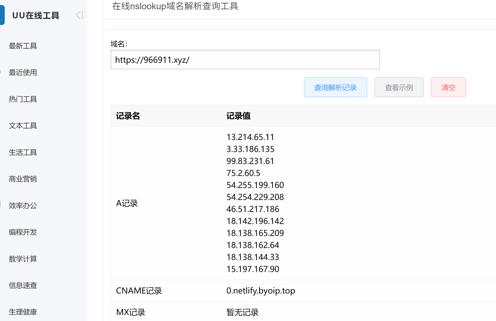
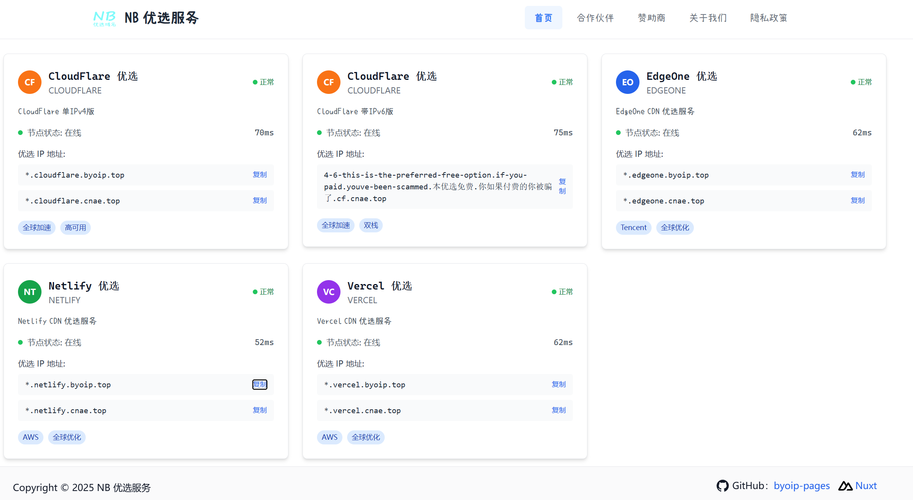
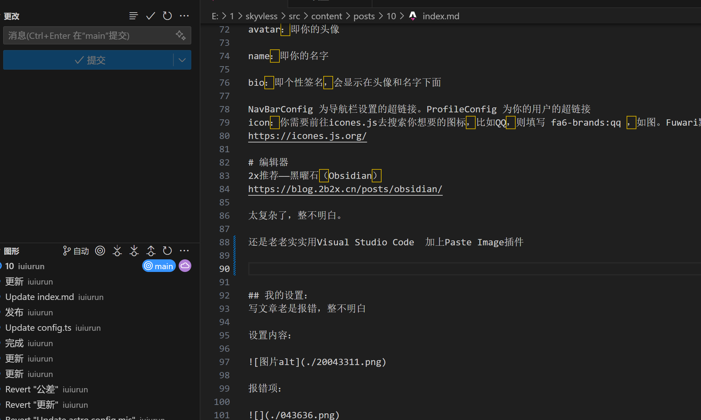

<details markdown><summary>2025-11-19 添加音乐播放器</summary>

## 添加音乐播放器
明月浩空播放器 https://myhkw.cn/

</details>

<details>
  <summary>2025-11-17增加首页图标</summary>
修改src/content/config.ts
图标在https://icones.js.org/查找
	

</details>

<details>
  <summary>2025-11-17添加折叠</summary>
  
html折叠：

```
<details>
  <summary>折叠</summary>
  内容
</details>
```

open删掉就可以折叠，反之展开。可以用HTML语法，譬如：```<a href="URL">链接文本</a>```


markdown折叠：
```
<details markdown open><summary>展开/收起</summary>

open删除立刻收起

</details>

```
</details>

<details>
  <summary>2025/11/15 部署在cloudflare works并且优选</summary>
弃用vercel是因为国内电信访问超慢，并且有许多地区无法打开！

优选域名来自：cf.090227.xyz推荐的：saas.sin.fan

采用：Worker路由反代全球并优选（新）
教程来自：<a href="https://blog.2b2x.cn/posts/cf-fastip/">2x.nz</a>
</details>

<details>
  <summary>2025-11-07添加统计</summary>
umami统计

https://umami.is/

注册完成，添加网站。统计代码放在/src/layouts/Layout.astro

```
<link rel="alternate" type="application/rss+xml" title={profileConfig.name} href={`${Astro.site}rss.xml`}/>
umami统计代码存放位置
	</head>
```
</details>

<details>
  <summary>2025-11-05 添加友链</summary>
是我参照https://blog.kimbleex.top/posts/2025-10-09-fuwari-friends/

然后用GTP 模仿https://pcb.im/friends/

修改而来的。


```<!--友链01-->
      <div class="friend-item">
        
        <div class="friend-meta">
          <div class="flex items-center gap-1 friend-title-row">
            <a href="链接" target="_blank" class="friend-title text-black dark:text-white">名字</a>
            <Icon name="material-symbols:open-in-new" class="friend-link-icon" />
          </div>
          <div class="friend-desc">描述</div>
        </div>
      </div>
```
</details>

<details>
  <summary>2025-11-04 添加评论</summary>
评论

Github的giscus

添加方法：https://thw.lol/posts/fuwari-giscus/
</details>

<details>
  <summary>2025-11-03备用一个解析查询</summary>
解析查询：
https://uutool.cn/nslookup/


</details>

<details>
  <summary>2025-11-02 博客部署vercel</summary>
部署在vercel

https://vercel.com/
解析优选 用的是WeTest.Vip:

*.vercel.182682.xyz

2025/10/26 部署更换为netlify
更换https://www.byoip.top/优选

*.netlify.byoip.top


</details>

<details>
  <summary>2025-09-15 电脑编辑器推荐</summary>
老老实实用Visual Studio Code  加上Paste Image插件



1. 打开插件设置界面
   在 VS Code 左侧点击扩展（或快捷键 Ctrl+Shift+X），找到已安装的 Paste Image 插件。
   点击插件名字，进入详情页后，点击右上角的设置齿轮，选择扩展设置。
2. 通过设置界面配置
   搜索并修改如下两个设置：
   ① Paste Image: Path
   搜索“Paste Image: Path”。
   在输入框里填写：
   代码
   ``${currentFileDir}``
   这表示图片会保存在当前 markdown 文件的同级目录。

② Paste Image: Insert Pattern
搜索“Paste Image: Insert Pattern”。
在输入框里填写：
代码
````
这样插入的就是标准的 Markdown 相对路径格式。

粘贴图片（Ctrl+Alt+V），会发现图片就在 md 同级目录,并且插入的就是相对路径的 Markdown 语法。

一般写文章是在本地仓库 pnpm dev 浏览器实时预览

在用Visual Studio Code写
</details>

<details>
  <summary>2024-07-07 Fuwari的基本信息修改</summary>
  title：你的博客主标题

subtitle：你的博客副标题。可选，在首页会显示为“主标题 - 副标题”

lang：博客显示语言。注释已经列出了一些常用的值，如：en, zh_CN, zh_TW, ja, ko

themeColor：hue值则是你的博客主题色，可以在你的博客右上角的画板图标确定喜欢的颜色再填写

banner：src：即banner图片，支持http/https URL

favicon：src：即网站图标，支持http/https URL

links：即友情链接，这些链接在导航栏上

avatar：即你的头像

name：即你的名字

bio：即个性签名，会显示在头像和名字下面

NavBarConfig 为导航栏设置的超链接。ProfileConfig 为你的用户的超链接

icon：你需要前往icones.js去搜索你想要的图标，比如QQ，则填写 fa6-brands:qq ，如图。Fuwari默认支持这几种类型：fa6-brands, fa6-regular, fa6-solid, material-symbols。可以在 astro.config.mjs 中搜索关键字进行配置
https://icones.js.org/
</details>


<details>
  <summary>2025-07-07同步文章</summary>
电脑是GitHub Desktop
https://desktop.github.com/download/
简单、方便

本地预览的话

clone 仓库文件夹

在终端打开
命令

```
pnpm install
```

```
pnpm dev
```

浏览器打开：http://localhost:4321/

</details>


<details>
  <summary>2024-07-06 Fuwari文章前置内容</summary>
  
```
---
title: 标题
published: 2025-11-20
description: "描述"
image: "./cover.jpeg""
tags: [标签]
category: 分类
draft: false
---

```

title	帖子的标题。
published	帖子发布的日期，时间在日期后加T22:18:00
description	帖子的简短描述。显示在索引页面上。
image	帖子的封面图片路径.
1.开头 或 ：使用网页图片
2.开头为 ：对于本目录./图片名称
3 中的图像。没有任何前缀：相对于 markdown 文件http://https:///public
tags	帖子的标签。
category	帖子的类别。
</details>


<details>
  <summary>2024-12-20 在cloudflare创建了RIN博客</summary>
<a href="https://github.com/openRin/Rin">Rin 是一个基于 Cloudflare Pages + Workers + D1 + R2 全家桶的博客，无需服务器无需备案，只需要一个解析到 Cloudflare 的域名即可部署。</a>  
访问太慢了，找不到优选的办法。
</details>

<details>
  <summary>2024-12-20域名解析</summary>
华为云国际版<a href="https://www.huaweicloud.com/intl/zh-cn/">https://www.huaweicloud.com/intl/zh-cn/</a>
无需实名认证，不需要手机号码。邮箱即可！
</details>


<details>
  <summary>2024-12-15在spaceship购入域名</summary>
<a href="https://www.spaceship.com/zh/domain-transfer-submit/">https://www.spaceship.com/zh/domain-transfer-submit/</a>
6位xyz域名新购和续费只要4块钱一年
</details>
