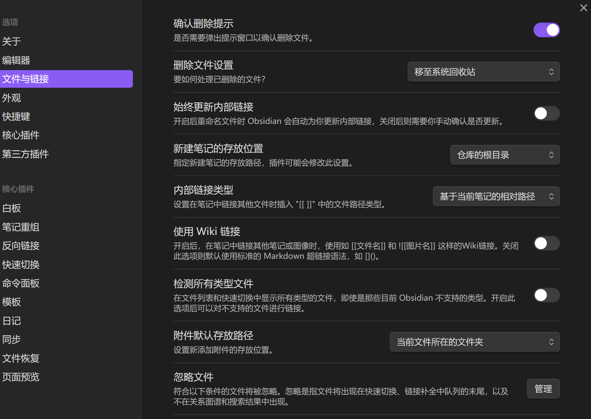
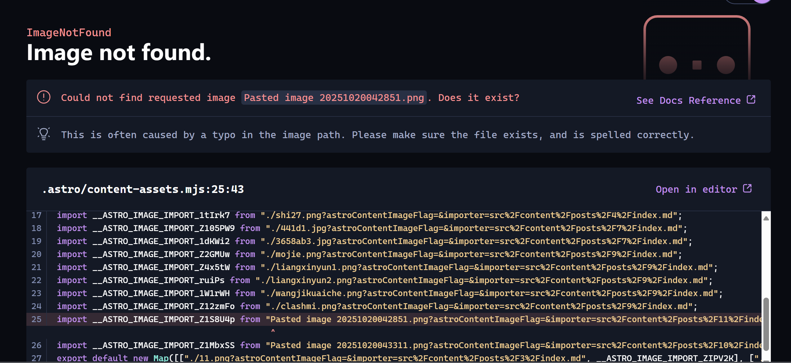

# 域名
spaceship购买
https://www.spaceship.com/zh/domain-transfer-submit/

# 解析

华为云国际版https://www.huaweicloud.com/intl/zh-cn/
无需实名认证，不需要手机号码。邮箱即可！

# 更新文章

src\content\posts\
新建文件夹（10）——新建index.md
图片在文件夹下
## 文章内容
```
---
title: 标题
published: 2025-10-20
description: "描述"
image: "./cover.jpeg"
tags: ["标签"]
category: 分类
draft: false
---
```
# 同步文章
电脑是GitHub Desktop
https://desktop.github.com/download/
简单、方便

# 本地预览的话
clone 仓库文件夹

在终端打开
命令
```
pnpm install
```

```
pnpm dev
```

浏览器打开：http://localhost:4321/

# Fuwari的基本信息修改

title：你的博客主标题

subtitle：你的博客副标题。可选，在首页会显示为“主标题 - 副标题”

lang：博客显示语言。注释已经列出了一些常用的值，如：en, zh_CN, zh_TW, ja, ko

themeColor：hue值则是你的博客主题色，可以在你的博客右上角的画板图标确定喜欢的颜色再填写

banner：src：即banner图片，支持http/https URL

favicon：src：即网站图标，支持http/https URL

links：即友情链接，这些链接在导航栏上

avatar：即你的头像

name：即你的名字

bio：即个性签名，会显示在头像和名字下面

NavBarConfig 为导航栏设置的超链接。ProfileConfig 为你的用户的超链接
icon：你需要前往icones.js去搜索你想要的图标，比如QQ，则填写 fa6-brands:qq ，如图。Fuwari默认支持这几种类型：fa6-brands, fa6-regular, fa6-solid, material-symbols。可以在 astro.config.mjs 中搜索关键字进行配置
https://icones.js.org/

# 编辑器
2x推荐——黑曜石（Obsidian）
https://blog.2b2x.cn/posts/obsidian/

太复杂了，整不明白。

我直接用Windows文本编辑器

## 我的设置：
写文章老是报错，整不明白

设置内容：



报错项：

