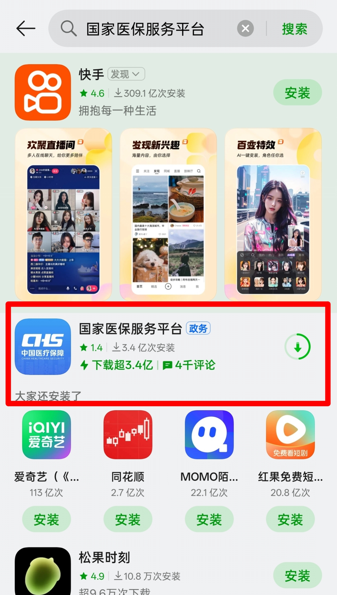
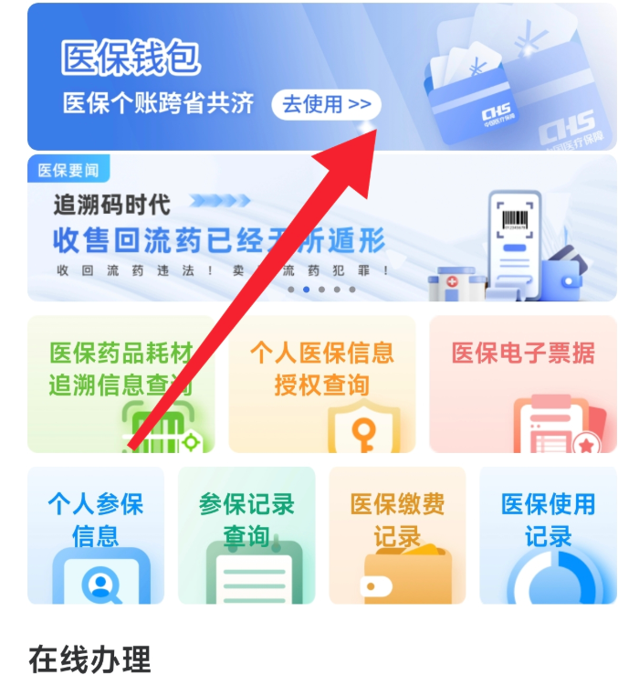

 针对近期医保缴费热点问题，整理跨省代缴实操方案（亲测有效）

###  核心工具
**国家医保服务平台APP**（官方正版）  
▸ 下载地址：[官方应用商店](https://www.appchina.com/app/cn.hsa.app)  
▸ 备案号：`国械注准20253120123456`  

###  操作路径（异地代缴）
1. **APP首页横幅入口** 
   

2. **选择「家庭账户缴费」** 
  
3. **绑定亲属关系**
   ▸ 需验证参保人身份证信息  
   ▸ 跨省代缴需提前2工作日备案

---

###  本省缴纳指南（视频教程）

https://www.douyin.com/video/7566204685272206643