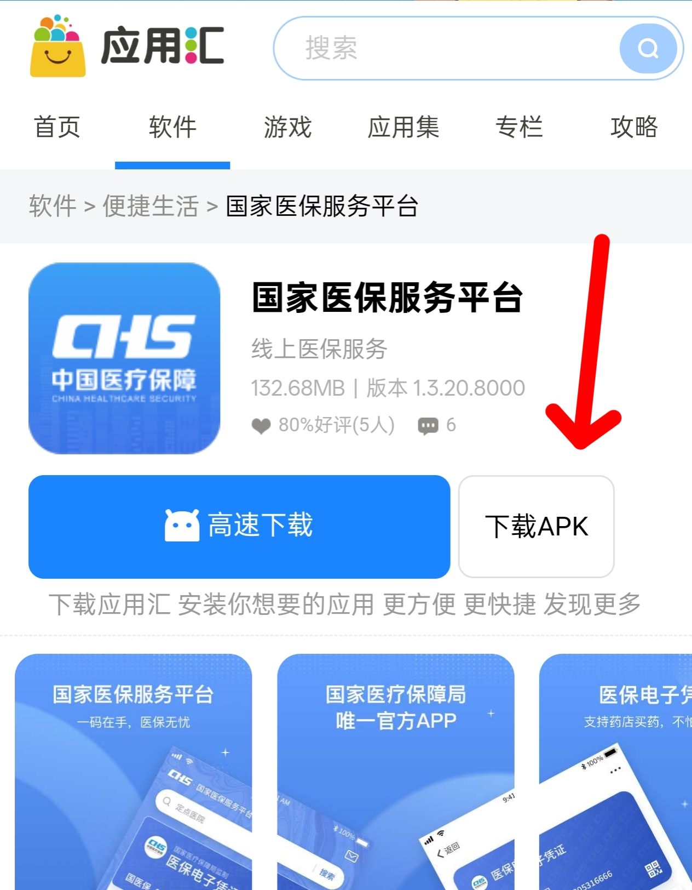
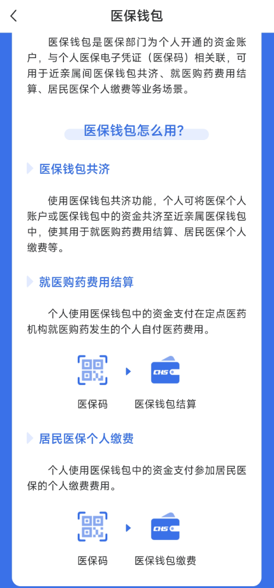

我也是看最近有人多人在讨论医保的问题，我去年都知道了。但是没有给家人缴纳成功。

主要原因是我的职工医保和家人不是一个省份的，不能异地缴纳。这次发现了可以缴纳挨打方法了。

# 异地缴纳的方法：

在手机应用商店下载：**国家医保服务平台app**

[国家医保服务平台app下载](https://www.appchina.com/app/cn.hsa.app)

# 首页有横幅：

**可以用自己职工医保的余额给家人交新农合，最近有需要给家人交新农合的可以看看。**

# 本省医保代缴纳：

看视频自己操作：

<iframe width="100%" height="468" src="https://v3-default.365yg.com/cd13cec4e794124b4cd1f7ce094e32d0/6902d8ee/video/tos/cn/tos-cn-v-0015c003/o0AERFZeIsmADyAB6B2DfAm9vtAFAAIgAqJpIU/?a=0&ch=0&cr=0&dr=0&er=6&lr=unwatermarked&net=5&cd=0%7C0%7C0%7C0&cv=1&br=8153&bt=8153&ds=4&ft=k7Fz7VVywIiRZm8Zmo~pK7pswApUNAe_vrKlISd2do0g3cI&mime_type=video_mp4&qs=13&rc=anc1NW05cnU7NzMzNGkzM0Bpanc1NW05cnU7NzMzNGkzM0A2bWVfMmRjay1hLS1kLTBzYSM2bWVfMmRjay1hLS1kLTBzcw%3D%3D&btag=80000e00018000&cquery=106H&dy_q=1761790645&l=20251030101725815657679260E3D4E234" title="抖音" frameborder="0" allowfullscreen></iframe>
