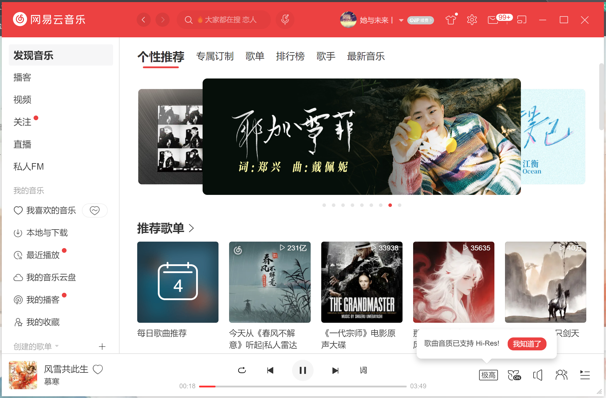

作为网易云音乐的老用户，最近更新新版本后真的被 UI 劝退了 —— 界面元素又大又杂乱，原本简洁的布局被各种冗余功能挤占，找歌单、切歌曲都要多花好几步。相信不少朋友和我一样，更偏爱旧版本的清爽设计，所以特意整理了这份能用的电脑版旧版安装包，分享给需要的人～

这款旧版本最大的优势就是回归音乐本质：没有强行植入的播客、K 歌入口，也没有拥挤到影响观感的大图标和宽间距，经典布局让操作一目了然。左侧歌单分类清晰，播放界面保留了大家熟悉的黑胶唱片设计，歌词显示简洁不突兀，整个视觉体验干净又舒服。

# 截图预览：

同时它也没丢核心功能：海量曲库依然能用，个性化推荐算法还是老样子精准，无损音质播放、本地歌曲管理、评论区互动这些基础需求全都满足。而且旧版本占用内存更小，运行起来比新版更流畅，不会有加载卡顿的情况，办公、学习时听歌完全不打扰。

安装也很简单，下载后直接运行安装包，记得勾选 “新版本提醒”，就能一直保留这个舒服的版本啦。如果和我一样反感新版的复杂 UI，想找回当初纯粹的听歌体验，赶紧码住这份旧版安装包，让音乐陪伴回归简单～

# 软件下载：

[https://www.123865.com/s/FVgJjv-CVkb3](https://www.123865.com/s/FVgJjv-CVkb3)

**密码：4hGd**
