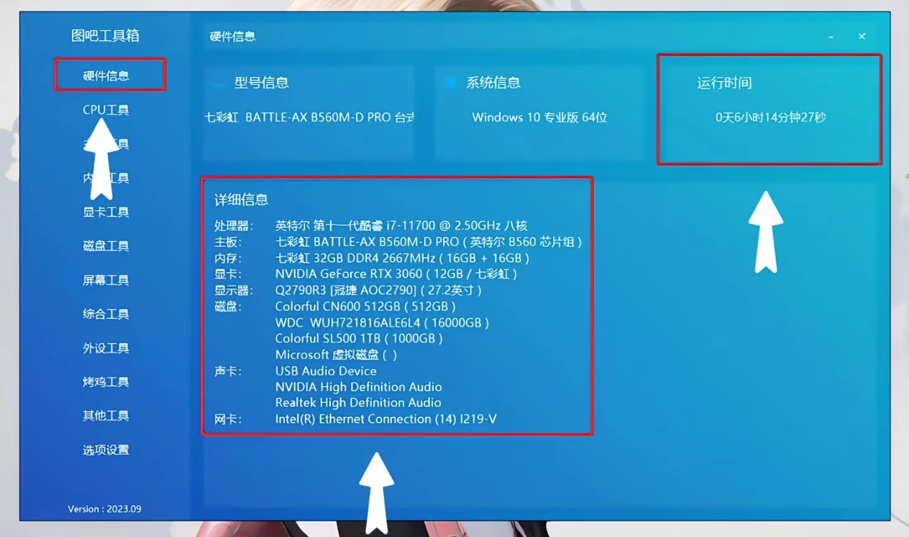
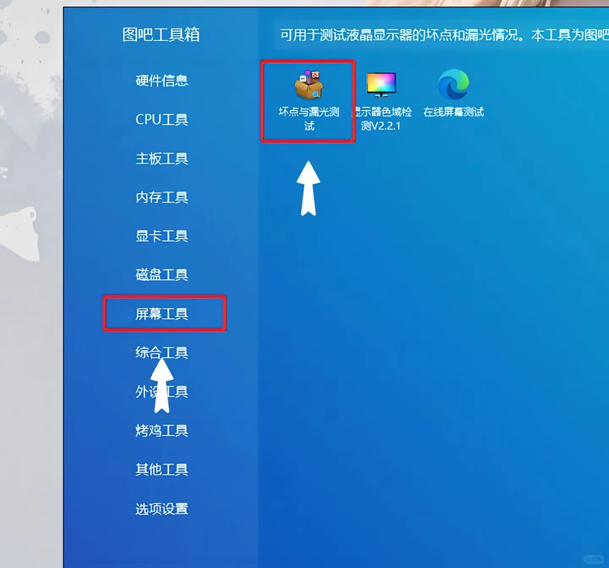
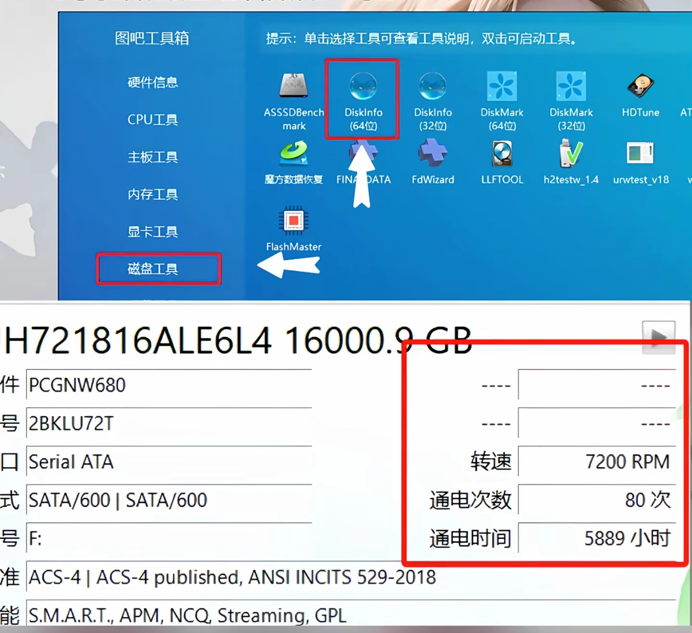
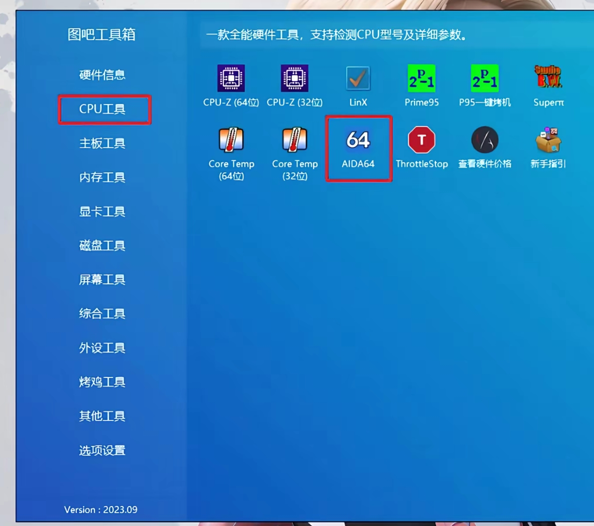
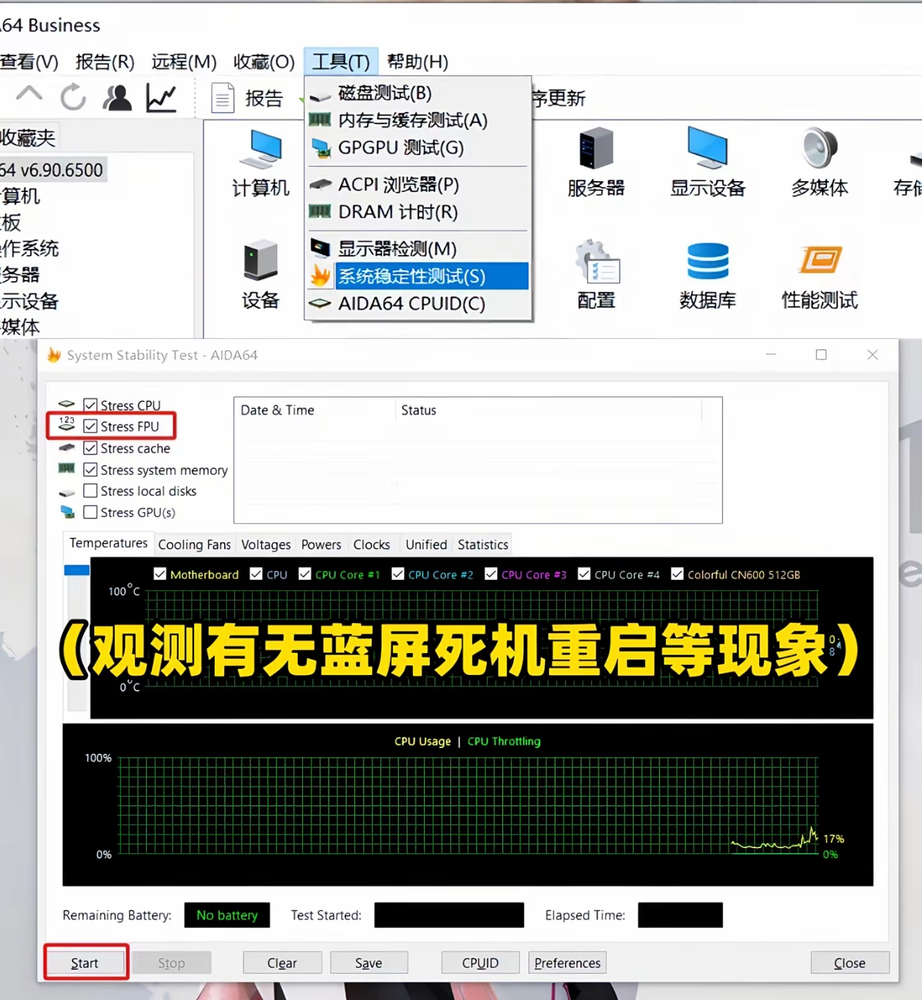
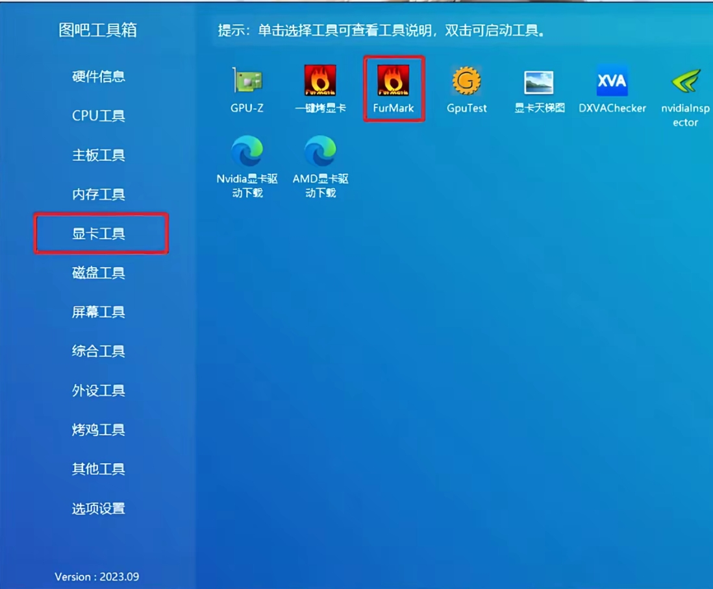
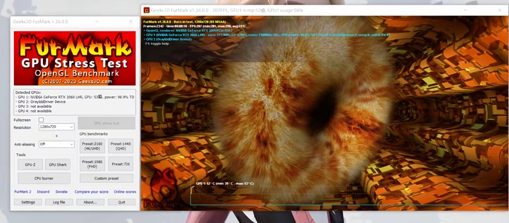

# 图吧工具箱：
[👉👉👉无资本做局版下载](https://soft.wsyhn.com/soft/tubagognjuxiang2024.9.0.0.exe)

# 验机流程：

## 第一步：核对电脑硬件信息

## 第二步：屏幕坏点＆漏光测试

**屏幕有多个坏点或严重漏光建议直接退换货**

## 第三步：检查通电次数＆通电时常

**个位数通电次数为正常**

## 第四步：CPU烤鸡 压力测试

**在工具中打开系统稳定性测试
勾选stressFPU,点击stat**

## 第五步：显卡烤鸡 压力测试

**打开FurMark后点击GPU stress test
《观测有无蓝屏死机重启等现象》**

