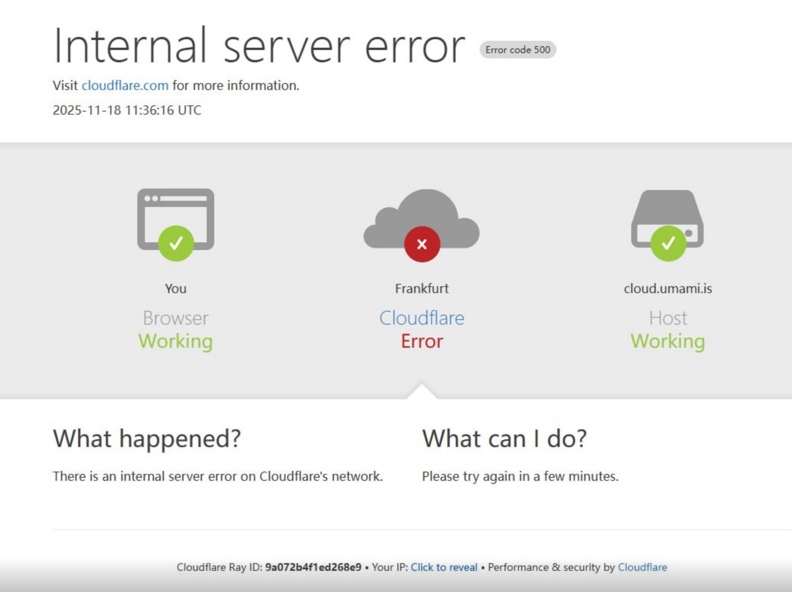
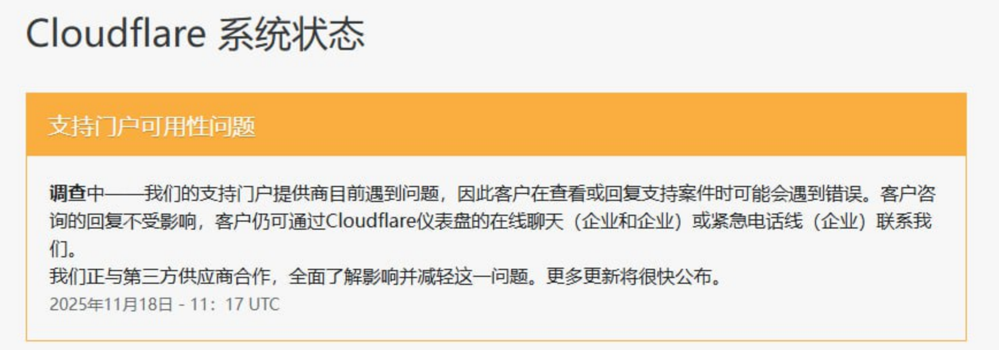

# 由于全球网络设施Cloudflare的崩溃

CMT+8 2025-11-18 19:29:33 Cloudflare 遭遇大规模故障

昨天 19:30 开始，Cloudflare 的 CDN 网络出现大规模故障，导致流量无法传递给源服务器。

由于 CDN 问题，故障牵连 Cloudflare 的大量服务，控制台也受到影响。19点48分，CF status 更新信息：“已注意到并正在调查一个可能影响多位客户的问题。如有更多信息，我们将及时公布。”

## Cloudflare官方回复

## Cloudflare 修复进度🛠：

https://www.cloudflarestatus.com

## 解决办法🤔

Cloudflare 遭遇大规模故障 我也是第一次遇到，之前没使用Cloudflare 的CDN加速，只遇到其他网站用CDN加速或者部署在Cloudflare 的网站有500报错。

出现这种问题，我第一时间想的是**登录Cloudflare 控制台 修改DNS解析（我的博客在netlify）** 有部署，可是问题来了！

Cloudflare崩溃 导致 控制台 无法进入😂

:::WARNING
陷入死循环！！！
:::

如果不需要把域名强制托管在Cloudflare 建议把域名托管在**[华为云解析国际版](https://www.huaweicloud.com/intl/zh-cn/)**

即使下一次出现问题，可以立刻将解析更换，马上解决网站**无法访问**的情况。

但是对于我来说，Cloudflare 的解决速度还是很快的，不在乎那点时间~
