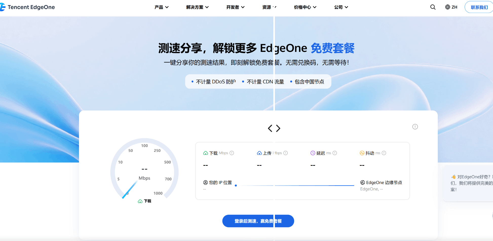
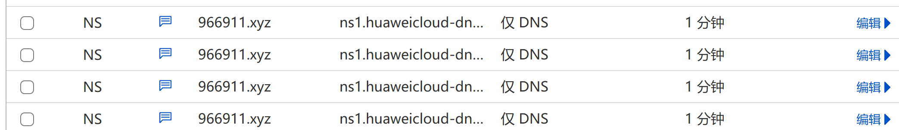
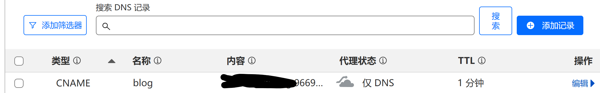
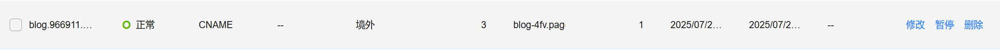

# **为什么需要 “分流加速”？**

我的博客部署在Cloudflare Pages  国内用户访问卡顿（海外 CDN 节点延迟高）

最近Edgeone比较火，正好我看到了测速分享就能获得edgeone加速套餐，无需发帖&抢Edgeone兑换码

## 活动链接：

[https://edgeone.ai/get-free-plan](活动链接)



# **分流部署前的准备工作**

### **一：需要有一个域名，并且托管在Cloudflare**

### **二：分别在Edgeone Pages 和 Cloudflare Pages** 构建部署Astro

### **三 ：登录Cloudflare 给自己的域名 添加 华为云解析NS**

[https://dash.cloudflare.com/]()

```
ns1.huaweicloud-dns.org
```

```
ns1.huaweicloud-dns.net
```

```
ns1.huaweicloud-dns.cn
```

```
ns1.huaweicloud-dns.com
```



***添加一条Edgeone CNAME给的解析 并且仅DNS解析不加速***



### 四：注册 华为云解析国际版并登录

[https://www.huaweicloud.com/intl/zh-cn/]()

### **添加两条CNAME解析**

##### 中国大陆：Edgeone优选域名  [eo.072103.xyz](https://2x.nz/posts/edgeone/ "二叉树树提供维护") 和 [*.edgeone.182682.xyz](https://www.wetest.vip/ "微测网提供")  任选一个


##### 境外：Cloudflare 提供的 CNAME解析



**这套方案解决了单一加速工具难以兼顾国内外用户体验的痛点，通过 “DNS 分流 + 双 CDN 适配” 的组合，既优化了国内访问的流畅度，又提升了海外用户的加载效率，最终实现了博客全球访问体验的全面升级。**
