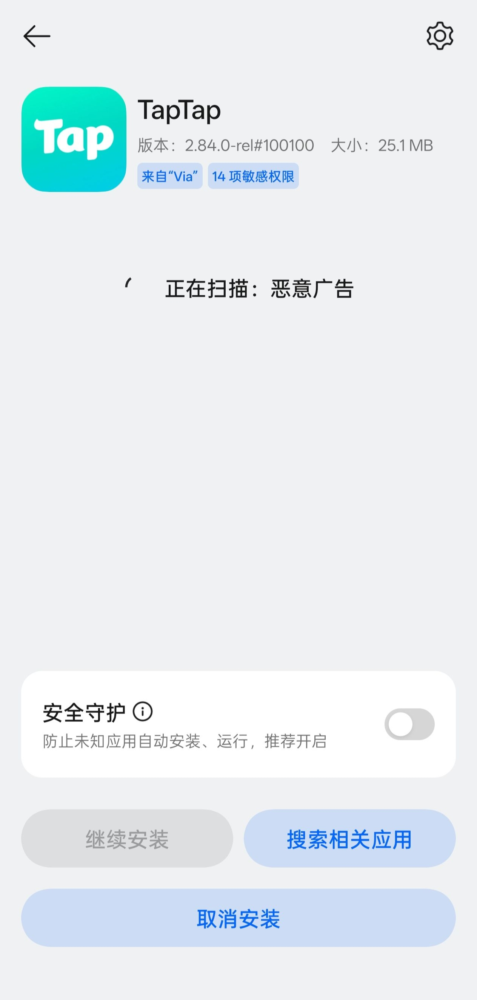
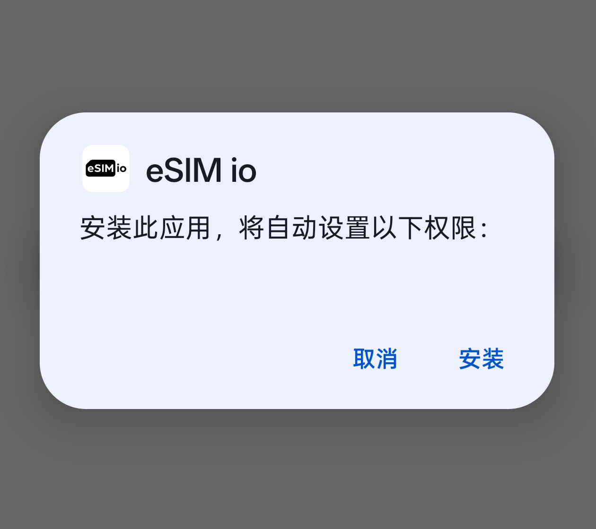

realme 自带系统安装器有广告扰人，安装速度慢，还严格限制安装来源，既影响使用体验，又给操作添不少麻烦。

## realme UI自带安装器：

## 安装CrossProfileTestApp后：

**如果要恢复原来的安装器，卸载CrossProfileTest App，后续请重启手机。**

**目前安装CrossProfileTest App后，当你进入省电模式后会强制打开黑夜模式（这个属于安卓类原生系统的功能）**

## CrossProfileTestApp下载：

[https://www.123pan.com/s/2dADVv-OjPJH.html](https://www.123pan.com/s/2dADVv-OjPJH.html)

### 备用下载：
[http://4275.com/54sdyp](http://4275.com/54sdyp)

如果想下载其他安卓版本的CrossProfileTestApp，请在浏览器 搜索“兼容性测试套件”
