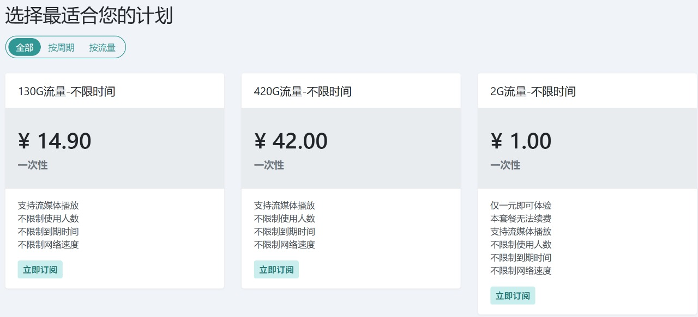
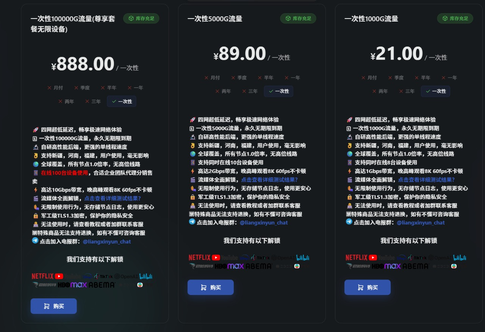
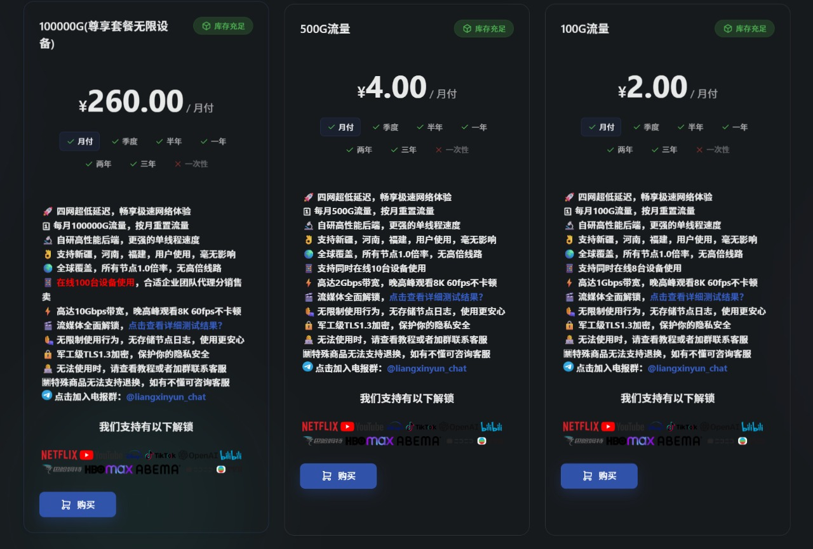
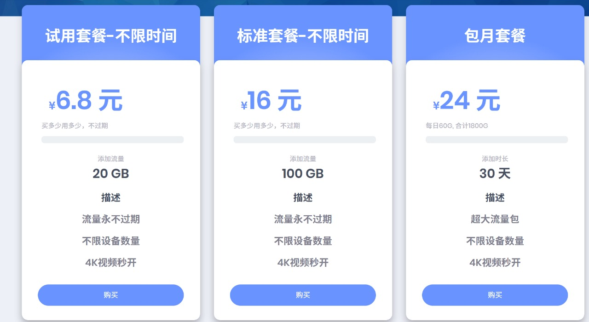
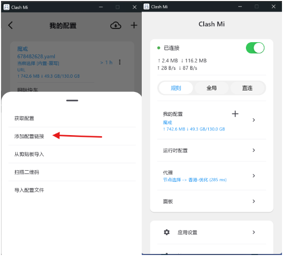

# 2024年机场推荐与全平台客户端使用分享

随着网络环境的变化，选择一个稳定、高性价比的机场服务商变得尤为重要。本文将分享我目前亲测推荐的机场服务，以及适合各平台的客户端选择建议。

---

## 一、魔戒

**注册地址**：[https://mojie.me/#/register?code=LqJr41tJ](https://mojie.me/#/register?code=LqJr41tJ)

**推荐理由**：
  - 2020年稳定至今，套餐不限时。
  - 支持流媒体播放
  - 不限制使用人数
  - 不限制到期时间
  - 不限制网络速度
**推荐套餐**：
14.90元 130GB不限时

---

## 二、良心云

**注册地址**：[https://xn--9kqz23b19z.com/#/register?code=vMKLrGnM](https://xn--9kqz23b19z.com/#/register?code=vMKLrGnM)

**推荐理由**：

  - 遍布全球的高速节点
  - 高速稳定的网络体验
  - 解锁各类流媒体服务
  - 同时支持多台设备使用
 
**不限时套餐推荐**：
21.00元 一次性1000GB，用完再买

**周期性套餐推荐**：

**小流量**建议 2.00元/月 100GB

**大流量**建议 4.00元/月 500GB

---

## 三、网际快车

**注册地址**：[https://wjkc66.vip?c=UPTLIE](https://wjkc66.vip?c=UPTLIE)

**推荐理由**：
  - 节点丰富、速度超快
  - 家宽IP：解锁全球流媒体/ChatGPT/Netflix，支持各类账号注册
  - 回国节点：高速访问国内网站/APP，轻松更换IP地址（抖音/小红书/快手等）
  - 游戏专用：超低延迟稳定连接，专为游戏优化
  - 家宽定制：独享家宽服务，适用于TK/抖音直播/养号等场景
  
**缺点**：流量偏贵、倍率较高

**套餐推荐**：
6.8元 20GB 不限时

---

# 客户端推荐（全平台）

| 平台    | 下载方式     | 链接                                                                                                                                        | 备注                                    |
| ------- | ------------ | ------------------------------------------------------------------------------------------------------------------------------------------- | --------------------------------------- |
| Android | 高速下载     | [☛高速下载☚](https://git.282888.xyz/https://github.com/KaringX/clashmi/releases/download/v1.0.9.134/clashmi_1.0.9.134_android_arm64-v8a.apk) | clashmi v1.0.9.134                      |
| Android | 备用下载     | [☛备用下载☚](https://github.com/KaringX/clashmi/releases/download/v1.0.9.134/clashmi_1.0.9.134_android_arm64-v8a.apk)                        | clashmi v1.0.9.134                      |
| Windows | 加速下载     | [☛加速下载☚](https://git.282888.xyz/https://github.com/KaringX/clashmi/releases/download/v1.0.9.134/clashmi_1.0.9.134_windows_x64.exe)       | clashmi v1.0.9.134                      |
| Windows | 备用下载     | [☛备用下载☚](https://github.com/KaringX/clashmi/releases/download/v1.0.9.134/clashmi_1.0.9.134_windows_x64.exe)                              | clashmi v1.0.9.134                      |
| Mac     | 加速下载     | [☛加速下载☚](https://git.282888.xyz/https://github.com/KaringX/clashmi/releases/download/v1.0.9.134/clashmi_1.0.9.134_macos_universal.dmg)   | clashmi v1.0.9.134                      |
| Mac     | 备用下载     | [☛备用下载☚](https://apps.apple.com/us/app/clash-mi/id6744321968)                                                                            | clashmi v1.0.9.134                      |
| iOS     | 应用商店安装 | [应用商店安装](https://apps.apple.com/us/app/clash-mi/id6744321968)                                                                            | 免费安装。需海外AppleID，如需可联系我。 |
| Linux   | 官方下载     | [☛点我下载☚](https://github.com/KaringX/clashmi/releases/download/v1.0.9.134/clashmi_1.0.9.134_linux_amd64.rpm)                              | clashmi v1.0.9.134                      |

---

*本文内容仅为个人体验分享，仅供学习交流使用。*
